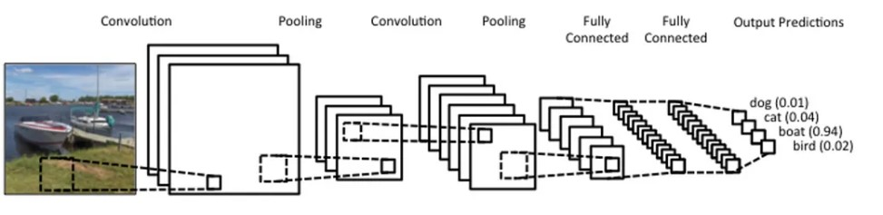
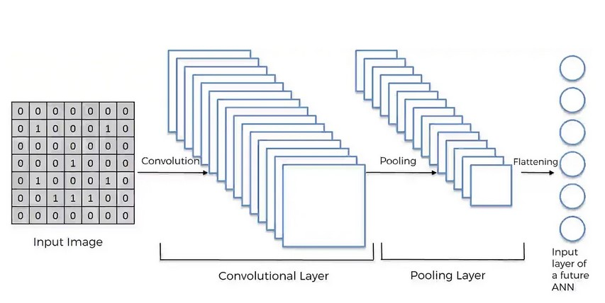

# NN Model for TCM Project (Group 13)

## install packages
run
```
pip install -r requirements.txt
# if use conda
conda install --yes --file requirements.txt
```
## fisrt runnable version with super simplified data

`cnn_simplfied_data1.ipynb`

## train one medicine each time
`cnn_simplified_data2.ipynb`

## train all medicine at one time (未完成)
`cnn_simplified_data2 mulyi_classifer.ipynb`
.

.

.

.


.

.

## sample code (顯示tensorflow.keras 的NN model 怎麼用)

`try_nn_1.ipynb`

## possible steps (???)

抓我們資料裡其中一小部分來試驗
or
模仿我們data 的模式generate一分假的資料出來做試驗

# Steps of CNN

### 文本處理

    文本向量化：將文本數據轉換為數值表示形式，比如將中文文字轉換成詞向量或字符向量。
    填充序列：確保所有文本序列的長度相同，如果需要，進行填充或截斷操作。

### 建立CNN模型

    卷積層與池化層：設計卷積層和池化層來提取特徵並減少輸入的維度。
    Flatten層與全連接層：將卷積池化後的特徵展平成向量，然後添加全連接層進行分類。

### 模型訓練與評估

    編譯模型：選擇損失函數、優化器和評估指標。
    訓練模型：使用已處理的數據訓練CNN模型，通常通過反向傳播算法來更新權重。
    評估模型：使用測試集來評估模型的性能，看準確度或其他指標。

### 模型調整和優化

    超參數調整：調整卷積層的數量、大小，池化層的選擇等，以提高模型性能。
    防止過擬合：使用正則化方法，如dropout層，以防止模型在訓練集上表現好但在測試集上表現差。

## CNN概念圖



## 3 Layers of CNN

### Convolution Layer卷積層

- 把matrix 相乘後再相加
` input map X feature detector --->  feature map `

### Pooling Layer 池化層
- one of the common pooling method: max pooling
- cut big matrix into submatrices, find the max of submatrices

```
            max pooling
 feature map ------->  pooled feature map 
```

### Fully Connected Layer 全連接層
- 把pooled feature map flatten成column vector (最基本的神經網絡)

```
            flattening
 pooled feature map ------->  a basic CNN 
```



## 例子

CNN 辦識手寫文字例子
https://medium.com/jameslearningnote/%E8%B3%87%E6%96%99%E5%88%86%E6%9E%90-%E6%A9%9F%E5%99%A8%E5%AD%B8%E7%BF%92-%E7%AC%AC5-1%E8%AC%9B-%E5%8D%B7%E7%A9%8D%E7%A5%9E%E7%B6%93%E7%B6%B2%E7%B5%A1%E4%BB%8B%E7%B4%B9-convolutional-neural-network-4f8249d65d4f

